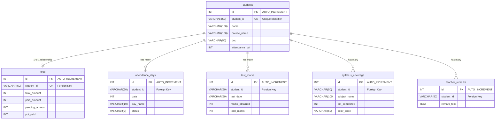

# Laxan Dashboard Database Schema

Below is the entity-relationship diagram for the Laxan Dashboard database based on the `backend/seed.js` setup.

```mermaid
erDiagram
    students ||--o| fees : "1-to-1 relationship"
    students ||--o{ attendance_days : "has many"
    students ||--o{ test_marks : "has many"
    students ||--o{ syllabus_coverage : "has many"
    students ||--o{ teacher_remarks : "has many"

    students {
        INT id PK "AUTO_INCREMENT"
        VARCHAR(50) student_id UK "Unique Identifier"
        VARCHAR(100) name
        VARCHAR(100) course_name
        VARCHAR(50) dob
        INT attendance_pct
    }

    fees {
        INT id PK "AUTO_INCREMENT"
        VARCHAR(50) student_id UK "Foreign Key"
        INT total_amount
        INT paid_amount
        INT pending_amount
        INT pct_paid
    }

    attendance_days {
        INT id PK "AUTO_INCREMENT"
        VARCHAR(50) student_id "Foreign Key"
        INT date
        VARCHAR(10) day_name
        VARCHAR(2) status
    }

    test_marks {
        INT id PK "AUTO_INCREMENT"
        VARCHAR(50) student_id "Foreign Key"
        VARCHAR(50) test_date
        INT marks_obtained
        INT total_marks
    }

    syllabus_coverage {
        INT id PK "AUTO_INCREMENT"
        VARCHAR(50) student_id "Foreign Key"
        VARCHAR(100) subject_name
        INT pct_completed
        VARCHAR(50) color_code
    }

    teacher_remarks {
        INT id PK "AUTO_INCREMENT"
        VARCHAR(50) student_id "Foreign Key"
        TEXT remark_text
    }
```
